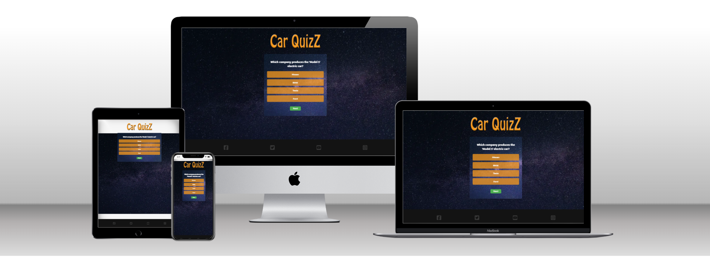
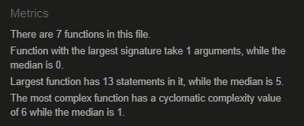
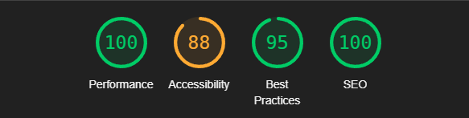

# Car QuizZ

# <u>Introduction</u>

Car QuizZ is an interactive web application designed to test users' knowledge of various car-related facts. This application provides a user-friendly experience for car enthusiasts to challenge themselves and learn interesting facts about cars, including their history, technology, and models.

# <u>Key Features</u>

- **Interactive Quiz**: Users can answer multiple-choice questions related to cars.
- **Score Tracking**: The application keeps track of the user's score throughout the quiz.
- **Responsive Design**: The quiz is fully responsive, adapting to different screen sizes for optimal user experience.
- **Accessible Design**: The application follows accessibility guidelines to cater to a wider audience, including contrast between background and foreground colors.
- **User Feedback**: After each question, users receive immediate feedback.

# <u>Technology Stack</u>

- **HTML**: Semantic markup for structuring content.
- **CSS**: Styling and responsive design implementation.
- **JavaScript**: Interactivity and dynamic content management.

# <u>Setup and Usage</u>

To run Car QuizZ, simply clone the repository and open the `index.html` file in a web browser. No additional setup is required.

# <u>Validations</u>

The code has been validated to ensure quality and meet the standards:

- [HTML: Validated with W3C Validator](https://jigsaw.w3.org/css-validator/validator?uri=https%3A%2F%2Fstefane85a.github.io%2Fquizzgame%2F&profile=css3svg&usermedium=all&warning=1&vextwarning=&lang=sv)
- [CSS: Validated with Jigsaw Validator](https://jigsaw.w3.org/css-validator/validator?uri=https%3A%2F%2Fstefane85a.github.io%2Fquizzgame%2F&profile=css3svg&usermedium=all&warning=1&vextwarning=&lang=sv)
- JavaScript: Validated with JSHint - image below

# <u>Tests Made</u>

## Devices

- Galaxy fold
- Galaxy S23
- Ipad
- Lenovo Legion Laptop

# <u>Deployment</u>

Car QuizZ is deployed on [GitHub Pages](https://stefane85a.github.io/quizzgame/). To view the live version, visit the provided link.

## <u>Version Control</u>

The project uses Git for version control and is hosted on GitHub at [Stefane85a](https://github.com/StefanE85a/quizzgame)

# <u>Screenshots</u>

# <u>Credits and Acknowledgements</u>

- Johan for helping me test the Quizz-Game and give me pointers.

### Media
- [Felix Mittermeier](https://www.pexels.com/sv-se/@felixmittermeier/) for a beautifull background-image.
- Google Fonts.
- FontAwesome.

### Code

Code is mostly written by me, inspired from

- Google searches like;
- Guides and troubleshooting-solutions
- Guides from W3schools
- Guides from Code institute

# <u>Future Enhancements</u>

- Adjust for more Accessibility points
- Add more info-sections in javascript, Css to make users better understand the functions.

